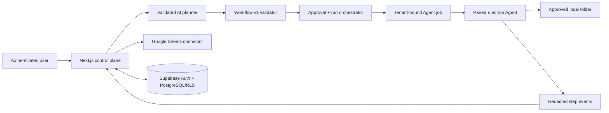

# Architecture

## Product boundary

AI Workflow Studio converts a natural-language request into a versioned,
validated workflow plan. AI output is treated as untrusted data. Only a
deterministic executor can perform registered operations after schema, semantic,
permission, and risk checks.

```text
Natural language
  -> AI planner
  -> workflow JSON
  -> schema validation
  -> semantic and registry validation
  -> permission and risk validation
  -> dry run
  -> user approval where required
  -> deterministic executor
  -> auditable run and step results
```



The browser never talks directly to the local filesystem. The control plane
stores an opaque folder alias and dispatches a tenant/device-bound Job; only the
paired Agent resolves that alias to a locally approved canonical path.

## Monorepo

```text
apps/
  web/                  Next.js control plane and server APIs
  desktop/              Electron local agent
packages/
  agent-protocol/       Pairing, device authentication, claims, leases, job state
  ai-gateway/           Server-only AI provider adapters and validation boundary
  google-sheets/        OAuth and bounded Sheets operations
  local-executor/       Bounded Excel/CSV I/O, transforms, watcher, and ledger
  run-orchestrator/     Run state, approval, dispatch, retry, audit, notification
  website-schema/      Guided brief and future Website Spec validation contracts
  workflow-schema/      Versioned Zod DSL and semantic validation
  workflow-engine/      Registry and deterministic orchestration
  connector-sdk/        Connector contracts and safe helpers
  shared/               Product config, errors, auth, and utility contracts
  ui/                   Shared presentation primitives
supabase/
  migrations/           Immutable PostgreSQL schema and RLS migrations
docs/                   Operations and engineering documentation
```

## Control plane

The Next.js application owns authentication UX, tenant-aware workflow APIs,
planner APIs, Google OAuth callbacks, job coordination, approvals, audit
visibility, and run dashboards. Supabase PostgreSQL is the source of truth.
Realtime is only a wake-up hint and is never the sole job-delivery mechanism.

The planner API accepts bounded context, selects a server-only provider adapter,
and treats every completion as untrusted text. Provider JSON modes improve
reliability, but the complete application-side Workflow v1 structural and
semantic validators remain authoritative. A bounded repair loop may request a
complete replacement plan; it never patches, executes, or returns invalid
content. See `docs/AI_GATEWAY.md`.

The AI Workspace also exposes a provider-neutral streaming chat boundary.
OpenAI, Anthropic, Gemini, and Mock streams are normalized into text deltas and
one terminal usage event. Ask mode has no tool registry and cannot dispatch
work. Conversations and messages are written by authenticated server routes,
bound explicitly to the session tenant, and stored separately from redacted
usage accounting. Plan messages may carry only a fully validated Workflow v1
object as bounded metadata.

Google authorization is modeled as an independent tenant-owned connection.
OAuth state and PKCE verification remain server-side; AES-256-GCM token
envelopes are bound to tenant, connection, and token kind. The connector exposes
validated read/append/update/sync primitives behind repository and idempotency
ports. Browser-facing views contain status and metadata only. See
`docs/GOOGLE_SHEETS.md`.

## Desktop data plane

Electron owns local folder authorization, file watching, Excel processing,
desktop notifications, and device job execution. It returns redacted metadata
and progress, not complete local spreadsheets. Local paths are represented in
cloud workflow data only by device-scoped folder aliases.

The sandboxed renderer receives an exact preload API and has no Node.js,
filesystem, token, or generic IPC access. The main process owns OS-encrypted
device credentials, the system folder picker, canonical grant paths, redacted
logs, polling, tray behavior, and user-initiated updates. See
`docs/DESKTOP_AGENT.md`.

The main process binds the local executor to a paired device's private folder
grant store. Excel/CSV readers apply file, row, sheet, column, ZIP-entry,
decompression, and compression-ratio limits before materializing safe scalar
rows. Writers use exclusive locks, private temporary files, reread validation,
atomic rename, verified backups where explicitly required, and SHA-256 receipt
deduplication. See `docs/EXCEL_EXECUTOR.md`.

## Agent job protocol

The database remains the durable Agent Job source. An opaque device token binds
every request to one tenant and device; job identifiers never establish
authorization. Polling discovers pending or expired-leased work, an atomic
claim issues a separate one-time claim credential, and bounded renewable leases
prevent active duplicate execution. Progress and terminal event UUIDs provide
request-level idempotency. See `docs/AGENT_PROTOCOL.md`.

`@ai-workflow-studio/run-orchestrator` owns the control-plane Run state machine.
It holds risky Runs for approval, dispatches one device-bound Job, reconciles
Agent step/terminal events, applies bounded retry/cancel/timeout behavior, and
returns output-free audit/notification views. The Desktop Agent independently
revalidates the Workflow and runs only its locally registered subset. See
`docs/RUN_ORCHESTRATION.md`.

## Website Studio boundary

Website Studio is a separate tenant-owned product area rather than an extension
of executable Workflows. Phase 23 persists only bounded project briefs. The
shared website schema requires purpose, audience, page goals/slugs, brand
direction, content notes, and calls to action before the server may transition a
project from `briefing` to `draft`.

Authenticated browsers receive tenant-scoped RLS reads only. Mutations derive
the actor and Tenant from `WorkspaceContext`, reject viewers, use the
server-only Supabase administrator client, and write metadata-only audit events.
The Phase 23 draft has no JavaScript, tool authority, preview origin,
deployment credential, or publishing capability.

AI Website Specs, registered components, sandboxed preview, reversible versions,
and explicit publishing are separate acceptance gates in Phases 24–27. See
[`WEBSITE_STUDIO.md`](./WEBSITE_STUDIO.md).

## Trust boundaries

1. Browser input and AI responses are untrusted and runtime-validated.
2. Tenant membership is enforced by both RLS and explicit service-role checks.
3. Device requests require a revocable token hash, tenant/device binding,
   timestamp validation, and strict request schemas.
4. File operations resolve real paths and remain under a user-authorized root.
5. OAuth/provider credentials remain server-side and encrypted at rest.
6. Node types and versions must be registered; arbitrary executable content is
   never accepted.
7. The Electron renderer is sandboxed and cannot name filesystem paths or IPC
   channels.
8. Chat streams contain text only; tools, provider credentials, and arbitrary
   executable payloads are outside the Phase 18 protocol.

## Initial architecture risks

| Risk                                                | Consequence                | Planned control                                                        |
| --------------------------------------------------- | -------------------------- | ---------------------------------------------------------------------- |
| AI returns executable or invented operations        | Arbitrary execution        | Strict JSON, Zod, registry allowlist, bounded repair                   |
| Tenant identifier is trusted from a client          | Cross-tenant exposure      | Auth-derived tenant context, membership checks, RLS                    |
| Folder path traversal or symlink escape             | Unauthorized local access  | Canonical paths, realpath containment, permission grants               |
| Duplicate/leased jobs execute twice                 | Duplicate writes           | Atomic claim, leases, idempotency keys, file hashes                    |
| Token or row data leaks through logs                | Credential/privacy breach  | Central redaction and metadata-only desktop reporting                  |
| Partial Excel writes corrupt output                 | Data loss                  | New output by default, temp files, verification, atomic rename, backup |
| Provider credentials missing at build time          | Broken development/release | Optional adapters and deterministic mock mode                          |
| Unsigned desktop release is presented as production | User trust/security issue  | Development artifact labeling and signing-aware release gates          |

## Product naming

The product name is exported by `packages/shared/src/product.ts`. Application
code and metadata consume that configuration instead of scattering product-name
literals.
